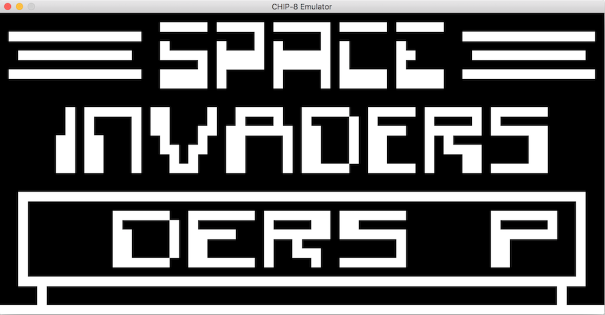

# CHIP-8

CHIP-8 emulator in C++

# Getting started

* Install SDL2 on machine
* Modify Makefile to ensure it points to correct SDL2 libraries

```
make
./Game invaders.rom
```

# Screenshots



# Acknowledgements

[Cowgod's CHIP-8 Technical Reference](http://devernay.free.fr/hacks/chip8/C8TECH10.HTM)

Was helpful in learning about the internals of CHIP-8.


[How to write an emulator (CHIP-8 interpreter)](http://www.multigesture.net/articles/how-to-write-an-emulator-chip-8-interpreter/)

My game.cpp was based off of the above link, due to my absence of knowledge of SDL2.